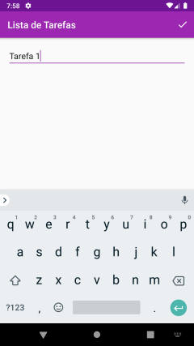

# Lista de Tarefas

Trata-se de aplicativo android simples, para inserção e controle de tarefas.

O aplicativo conta com as seguintes telas:

* Tela Inicial: Contendo a lista de tarefas salvas pelo usuário;
* Floating Action Button:  Para a inserção de novas tarefas;
* Tela para Inclusão de novas Tarefas: Tela para Adicionar/Sobrescrever tarefas;

##  Printscreens do App

O Aplicativo é bem simples, como se percebe das imagens abaixo:

